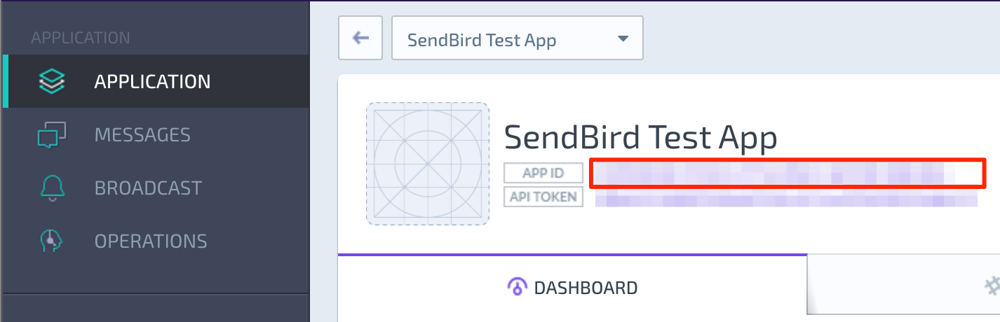

# Create an Application on SendBird Dashboard

You must first create an application on SendBird Dashboard before being able to using it for your project. 

1. Sign in at [SendBird Dashboard](https://dashboard.sendbird.com).
1. Select **APPLICATION** on the side menu and click the **NEW APP**.
1. Fill up the form with details of your application and click **CREATE** button.

You can see the **APP ID** of your application on the dashboard:

The **APP ID** is required to initialize the iOS framework.